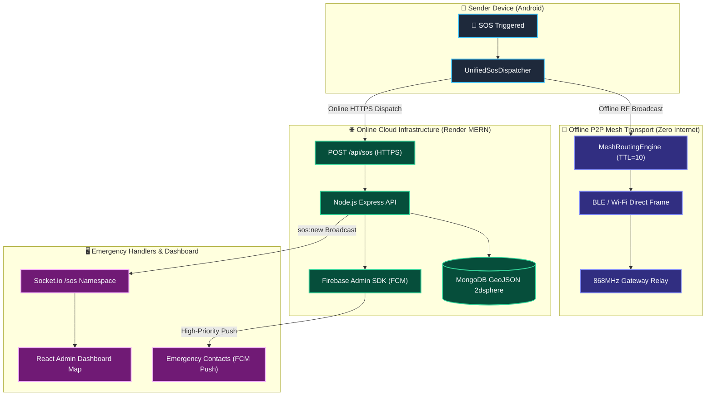
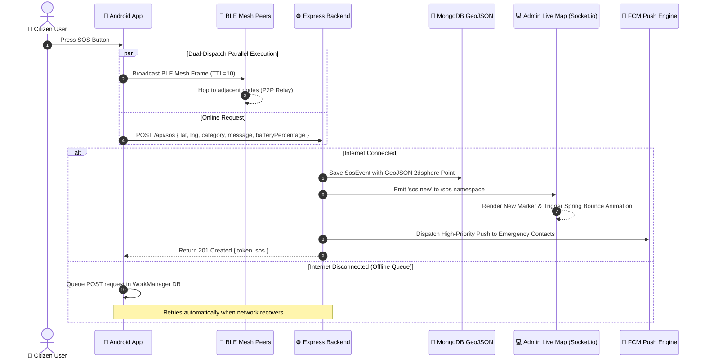
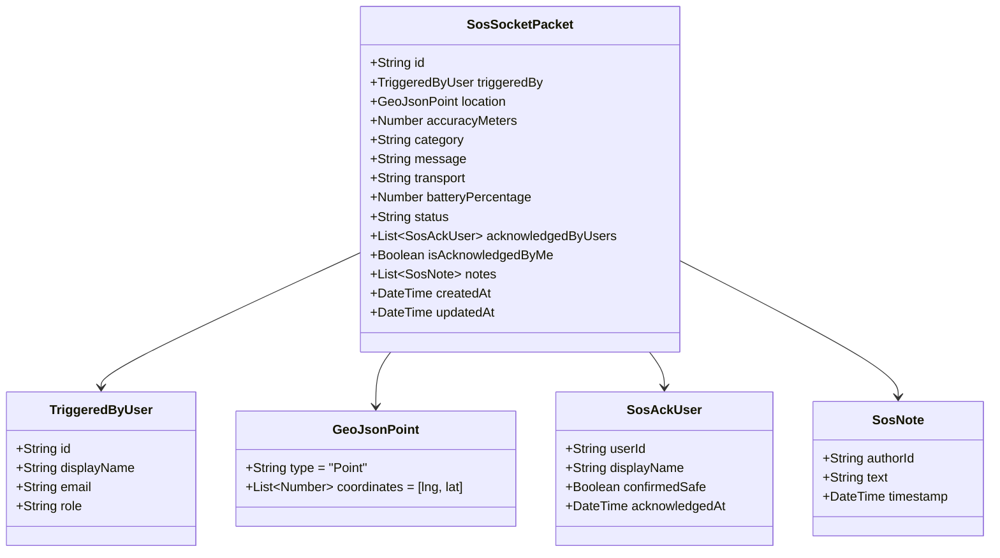

# 📡 ZeroGrid Packet Architecture & Protocol Specification

> [!IMPORTANT]
> ZeroGrid operates on a **Dual-Transport Protocol**. Every emergency dispatch automatically fans out across both an **Offline P2P Mesh Frame** (via BLE / Wi-Fi Direct / 868MHz) and an **Online REST/WebSocket Packet** (via HTTPS & Socket.io).

---

## 1. End-to-End Packet Lifecycle



---

## 2. P2P Offline Mesh Frame Layout (Byte-Level RF Packet)

Below is the binary packet layout transmitted over **Bluetooth Low Energy (BLE)** and **Wi-Fi Direct** with zero internet connection:

```mermaid
gantt
    title P2P BLE Mesh Packet Header & Payload Bitmask (32-Bit Word Alignment)
    dateFormat X
    axisFormat %s

    section Word 0
    Magic Byte (0x5A "ZG")        :0, 8
    Packet Type (0x01 SOS)         :8, 16
    TTL Hop Count (Max 10)         :16, 24
    Battery Level (0-100%)         :24, 32

    section Word 1
    Sender Node ID Hash (Bytes 4-7) :32, 64

    section Word 2
    Target Addr (0xFFFFFFFF Broadcast) :64, 96

    section Word 3
    Latitude (IEEE 754 Float32)     :96, 128

    section Word 4
    Longitude (IEEE 754 Float32)    :128, 160

    section Word 5
    Accuracy Meters (Float16)      :160, 176
    Category Enum (3 Bits)         :176, 184
    Payload Length (Bytes)         :184, 192
    Reserved Flags                 :192, 208

    section Payload
    UTF-8 Encoded Message Payload  :208, 272
    CRC-32 Integrity Checksum      :272, 304
```



### Binary Header Field Matrix

| Offset (Bytes) | Field Name | Data Type | Size | Description / Valid Values |
| :--- | :--- | :--- | :--- | :--- |
| `0x00` | **Magic Header** | `uint8` | 1 Byte | Protocol Identifier (`0x5A` = ZeroGrid Frame) |
| `0x01` | **Packet Type** | `uint8` | 1 Byte | `0x01`: SOS Alert, `0x02`: Beacon, `0x03`: Ack, `0x04`: Peer Ping |
| `0x02` | **TTL Hop Count** | `uint8` | 1 Byte | Decremented at each relay node (Starts at `10`, dropped when `0`) |
| `0x03` | **Battery Level** | `uint8` | 1 Byte | Sender's current battery percentage (`0` to `100`) |
| `0x04 - 0x07` | **Sender Node Hash**| `uint32` | 4 Bytes | Truncated SHA-256 hash of sender public key or MAC |
| `0x08 - 0x0B` | **Target Address** | `uint32` | 4 Bytes | Destination Node ID (`0xFFFFFFFF` for mesh-wide broadcast) |
| `0x0C - 0x0F` | **Latitude** | `float32`| 4 Bytes | Signed WGS84 GPS Latitude coordinate |
| `0x10 - 0x13` | **Longitude** | `float32`| 4 Bytes | Signed WGS84 GPS Longitude coordinate |
| `0x14 - 0x15` | **Accuracy** | `uint16` | 2 Bytes | GPS accuracy radius in meters |
| `0x16` | **Category** | `uint8` | 1 Byte | `0`: OTHER, `1`: MEDICAL, `2`: DISASTER, `3`: TRAPPED, `4`: SECURITY |
| `0x17` | **Payload Length** | `uint8` | 1 Byte | Length of variable string payload (0–64 Bytes) |
| `Var` | **Message Payload** | `string` | 0-64 B | UTF-8 encoded user alert text |
| `End - 4` | **CRC-32** | `uint32` | 4 Bytes | Frame validation integrity checksum |

---

## 3. Dual-Dispatch Sequence Diagram



---

## 4. Online WebSocket Packet Structure (`/sos` Namespace)

When a new SOS event is created or updated, the Node.js server broadcasts the following JSON packet over **Socket.io** (`wss://zerogridweb.onrender.com/sos`):



---

## 5. FCM Push Notification Packet Structure

> [!TIP]
> Google Firebase Cloud Messaging (FCM) delivers high-priority heads-up notifications directly to registered emergency contacts.

```mermaid
json
{
  "notification": {
    "title": "🚨 Emergency SOS Alert",
    "body": "Jane Doe triggered a MEDICAL emergency. Immediate assistance requested."
  },
  "data": {
    "sosId": "6651c89f2a4b123456789abc",
    "category": "MEDICAL",
    "lat": "19.0760",
    "lng": "72.8777",
    "accuracy": "12.5",
    "battery": "84",
    "timestamp": "1758852600000"
  }
}
```
