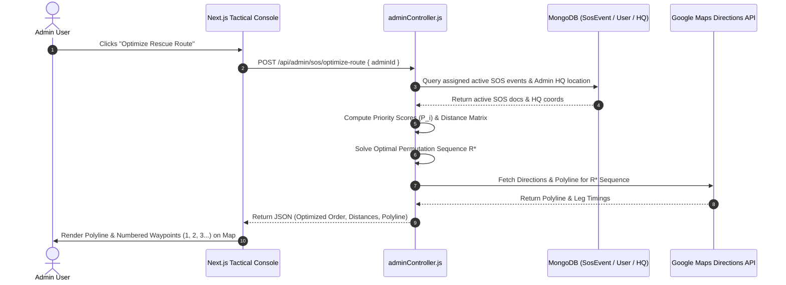

# ZeroGrid Tactical Console: Multi-Factor Route Optimization Architecture

## 1. System Overview

In disaster response scenarios, an administrative responder may be assigned multiple emergency SOS signals simultaneously. Standard shortest-path routing (e.g., standard Traveling Salesperson Problem) is inadequate because it ignores critical factors such as **victim device battery depletion**, **medical urgency**, and **time elapsed since dispatch**.

The ZeroGrid Multi-Factor Route Optimization system combines **spatial geometry**, **device telemetry**, and **tactical priority weighting** to compute the optimal rescue sequence for any assigned admin.

---

## 2. Mathematical Formulations

### 2.1 Composite Priority Score ($P_i$)

For every assigned SOS event $i$, a composite Priority Score $P_i$ is computed:

$$P_i = S_{\text{category}}(i) + S_{\text{battery}}(i) + S_{\text{time}}(i)$$

#### A. Category Urgency Score ($S_{\text{category}}$)
Reflects the medical and tactical severity of the emergency:

$$S_{\text{category}}(i) = \begin{cases} 
100 & \text{if category} = \text{MEDICAL} \\
85 & \text{if category} = \text{TRAPPED} \\
70 & \text{if category} = \text{DISASTER} \\
50 & \text{if category} = \text{SECURITY} \\
30 & \text{if category} = \text{OTHER}
\end{cases}$$

#### B. Battery Depletion Penalty Score ($S_{\text{battery}}$)
As a victim's device battery drops, the probability of device failure and loss of tracking increases. Low battery exponentially increases priority:

$$S_{\text{battery}}(i) = \begin{cases} 
100 - \text{batteryPercentage}_i & \text{if } \text{batteryPercentage}_i \neq \text{null} \\
40 & \text{if } \text{batteryPercentage}_i = \text{null}
\end{cases}$$

*Example:* A victim with **12% battery** yields $100 - 12 = \mathbf{88\text{ priority points}}$.

#### C. Starvation Prevention / Time Elapsed Score ($S_{\text{time}}$)
Prevents lower-priority events from being infinitely starved by adding $+1$ point per minute elapsed, capped at $+50$ points:

$$S_{\text{time}}(i) = \min\left(50, \; \left\lfloor \frac{t_{\text{current}} - t_{\text{createdAt}}}{60 \text{ seconds}} \right\rfloor\right)$$

---

### 2.2 Great-Circle Spatial Distance (Haversine Formula)

Distance between geographic coordinates $(\text{lat}_1, \text{lng}_1)$ and $(\text{lat}_2, \text{lng}_2)$ in kilometers:

$$\Delta\phi = \frac{(\text{lat}_2 - \text{lat}_1) \cdot \pi}{180}, \quad \Delta\lambda = \frac{(\text{lng}_2 - \text{lng}_1) \cdot \pi}{180}$$

$$a = \sin^2\left(\frac{\Delta\phi}{2}\right) + \cos\left(\frac{\text{lat}_1 \cdot \pi}{180}\right) \cdot \cos\left(\frac{\text{lat}_2 \cdot \pi}{180}\right) \cdot \sin^2\left(\frac{\Delta\lambda}{2}\right)$$

$$c = 2 \cdot \text{atan2}\left(\sqrt{a}, \; \sqrt{1-a}\right)$$

$$d = R \cdot c \quad \text{where } R = 6371 \text{ km}$$

---

### 2.3 Route Cost Function ($\text{Cost}(R)$)

For an admin origin $O$ and an ordered permutation sequence of waypoints $R = [O, W_1, W_2, \dots, W_N]$, the route penalty cost is defined as:

$$\text{Cost}(R) = \sum_{k=1}^{N} \left( \alpha \cdot d(W_{k-1}, W_k) - \frac{\beta \cdot P_{W_k}}{k} \right)$$

Where:
* $d(W_{k-1}, W_k)$ is the spatial travel distance from waypoint $k-1$ to waypoint $k$.
* $k$ is the 1-indexed position order of the waypoint in the rescue route.
* $\alpha = 1.0$ (distance weighting multiplier).
* $\beta = 0.5$ (priority decay multiplier).
* Dividing $P_{W_k}$ by $k$ ensures that high-priority events placed early in the route ($k = 1, 2$) subtract the maximum penalty, minimizing total cost.

---

## 3. Optimization Algorithms

Depending on the number of assigned waypoints $N$:

### 3.1 Exact Permutation Solver ($N \le 8$)
1. Generate all $N!$ route permutations.
2. Evaluate $\text{Cost}(R)$ for each permutation.
3. Select sequence $R^*$ that minimizes $\text{Cost}(R)$.

### 3.2 Priority Insertion Ratio Heuristic ($N > 8$)
1. Set current location $u = O$, unvisited set $V = \{W_1, W_2, \dots, W_N\}$.
2. While $V \neq \emptyset$:
   Select next waypoint $v^* \in V$ that minimizes ratio:
   $$v^* = \arg\min_{v \in V} \left( \frac{d(u, v)}{P_v} \right)$$
   Append $v^*$ to route, set $u = v^*$, remove $v^*$ from $V$.

---

## 4. Architecture & Data Flow



---

## 5. API Specification

### `POST /api/admin/sos/optimize-route`

#### Request Body
```json
{
  "adminId": "6aadb2800791e0e38529eb68",
  "originOverride": {
    "lat": 28.6289,
    "lng": 77.2195
  }
}
```

#### Response (200 OK)
```json
{
  "adminId": "6aadb2800791e0e38529eb68",
  "totalWaypoints": 3,
  "totalDistanceKm": 12.8,
  "estimatedTimeMinutes": 26,
  "optimizedRoute": [
    {
      "step": 1,
      "sosId": "6ab70dc5d2077d933a527e39",
      "category": "MEDICAL",
      "batteryPercentage": 12,
      "priorityScore": 188,
      "location": { "lat": 28.6145, "lng": 77.2095 },
      "distanceFromPrevKm": 2.4,
      "estTravelTimeMin": 5
    },
    {
      "step": 2,
      "sosId": "6ab70dc6d2077d933a527e3a",
      "category": "TRAPPED",
      "batteryPercentage": 35,
      "priorityScore": 150,
      "location": { "lat": 28.6080, "lng": 77.0864 },
      "distanceFromPrevKm": 4.1,
      "estTravelTimeMin": 9
    }
  ],
  "polyline": "a~l~Ffy{uO..."
}
```

---

## 6. Frontend UI Components

1. **Map Canvas Overlay:** Renders Google Maps `Polyline` connecting the Admin's HQ through Waypoints `1`, `2`, `3` with numbered badges.
2. **Tactical Console Waypoint Drawer:** Displays turn-by-turn cards with priority breakdown tags (`[1] MEDICAL • 12% Battery • 2.4 km`).
